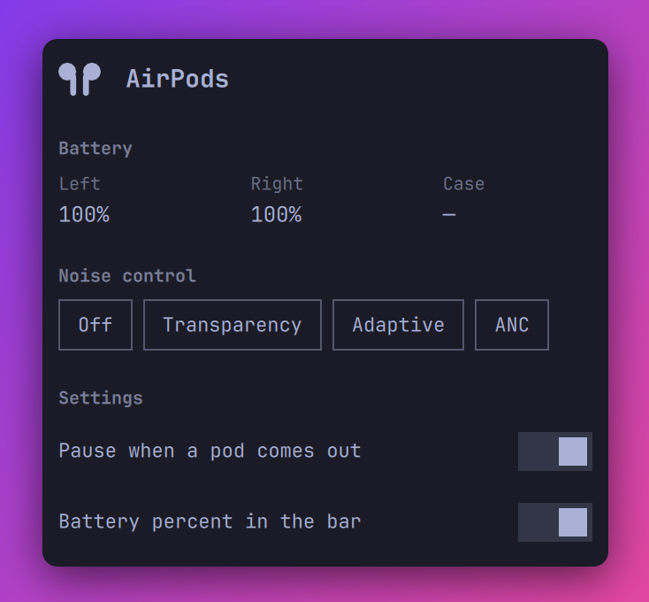

# omarchy-airpods

AirPods noise control and battery in the [Omarchy](https://omarchy.org/) bar.

Standard Bluetooth profiles carry audio and the media keys, but they do not
carry noise control mode, per-pod battery, or in-ear status. Apple sends these
over a vendor protocol (AAP) on L2CAP PSM `0x1001`. This plugin speaks that
protocol directly.



The plugin pauses the music when you take a pod out, and continues it when
the pod goes back in. It acts only on a player that it paused itself, and
only while the AirPods are the current audio output.

The panel shows:

- The device name and the model number
- The battery level of each pod, and of the case when it reports one
- Buttons for Off, Transparency, Adaptive, and ANC, with the current mode
  selected

The bar shows an AirPods icon with the battery level of the lowest pod. The
widget leaves the bar while no AirPods are connected, the way the microphone
and media widgets do. Connecting is BlueZ's work, not the panel's.

## Install

```bash
omarchy plugin add https://github.com/s0up4200/omarchy-airpods.git
omarchy plugin enable soup.airpods
```

To put the widget somewhere else on the bar, give `omarchy bar move` a
placement:

```bash
omarchy bar move soup.airpods --section right --after omarchy.clock
```

Then tell BlueZ to identify itself as an Apple device, or the AirPods refuse
the AAP channel. Add this line to `/etc/bluetooth/main.conf`:

```ini
DeviceID = bluetooth:004C:0000:0000
```

Restart Bluetooth and reconnect the AirPods:

```bash
sudo systemctl restart bluetooth
```

There are no other dependencies. The backend is one Python script that uses
the standard library only.

## Do not run LibrePods at the same time

The AirPods accept one AAP client. If [LibrePods](https://github.com/librepods-org/librepods)
holds the channel, this plugin reads stale data and its commands are ignored.
Use one or the other.

LibrePods still does more: conversational awareness, hearing aid settings,
head gestures, and renaming. This plugin gives you noise control, battery,
and auto-pause from the bar.

## Command line

The backend works on its own:

```bash
~/.config/omarchy/plugins/soup.airpods/bin/airpods watch
~/.config/omarchy/plugins/soup.airpods/bin/airpods selftest
```

`watch` holds the channel open and prints a line for each change, which is
what the panel runs:

```json
{"connected": true, "address": "…", "name": "AirPods Pro", "model": "A3047",
 "mode": "adaptive", "battery": {"left": 90, "right": 85, "case": null},
 "ear": ["in_ear", "in_ear"]}
```

The AirPods report the mode and the model one time for each Bluetooth
connection, to the client that holds the channel at that moment. A client
that connects later reads almost nothing. This is why the panel keeps one
`watch` open. `watch` also takes mode names on stdin, because a write must
go out on the channel that the AirPods are listening to.

A `null` battery level means the component did not report one, and the panel
shows `—`. The case does this while the pods are in your ears. It also does it
when you put one pod in the case, because that disconnects the other pod.

## Interactions

- Bar icon: a click of any button toggles the panel.
- Panel: Tab and Shift+Tab move to the neighboring bar panel, Esc closes. The
  mode buttons and the switches are mouse-only.
- IPC: `omarchy-shell soup.airpods <open|close|show|hide|toggle>`. This also
  works while the AirPods are away and the widget is off the bar, which is
  how you reach the settings then.

## Settings

The panel has a Settings section with a switch for each of these. A switch
writes to the widget's entry in `~/.config/omarchy/shell.json`. The same keys
take a value from the command line:

```bash
omarchy bar set soup.airpods showBattery false --json
```

Booleans need `--json`. Without it the value is stored as a string, which the
widget reads as off whichever value you type.

| Key | Default | What it does |
|---|---|---|
| `showBattery` | `true` | Show the battery percent next to the bar icon |
| `autoPause` | `true` | Pause the music when a pod comes out |

## Tested with

AirPods Pro (models A3047 and A3048) on Omarchy 4, BlueZ 5.87. Other AirPods
models use the same protocol, but they are not tested. Reports are welcome.

## Development

The shell watches the plugin directory, but a bar widget that is already on
the bar keeps the QML it loaded. After an edit, run:

```bash
omarchy restart shell
```

## How it works

`bin/airpods` connects to L2CAP PSM `0x1001`, sends the AAP handshake, then
asks for the feature flags and the notification stream. The AirPods answer
with metadata, battery, and mode packets. Writing a mode is one control
command packet on the same channel, which is why `watch` reads mode names
from stdin.

## Credit

This plugin exists because of [LibrePods](https://github.com/librepods-org/librepods)
by Kavish Devar. That project did the hard part: it reverse-engineered Apple's
AAP protocol and wrote down what every packet means. The handshake, the
opcodes, the battery layout, the control command for the listening mode, and
the 300 ms gap that the AirPods need after the handshake all come from reading
its source.

No code was copied. The packet layouts are facts about Apple's protocol, and
this plugin implements a small part of them in Python.

## Donations

If this plugin is useful to you, the Sponsor button in the sidebar takes you
to GitHub Sponsors and Buy Me a Coffee. Very welcome, never expected.

## License

MIT, the same license as Omarchy, so this code can move into Omarchy if it
ever belongs there. LibrePods is GPL-3.0; no code from it is used here.
