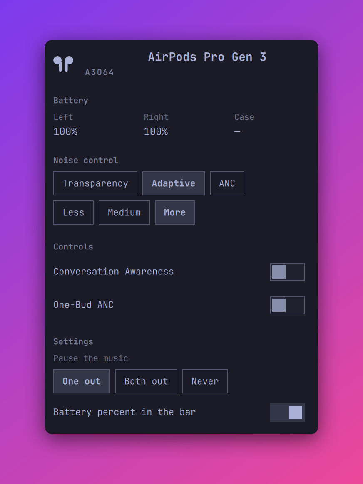

# omarchy-airpods

AirPods noise control and battery in the [Omarchy](https://omarchy.org/) bar.

Standard Bluetooth profiles carry audio and the media keys, but they do not
carry noise control mode, per-pod battery, or in-ear status. Apple sends these
over a vendor protocol (AAP) on L2CAP PSM `0x1001`. This plugin speaks that
protocol directly: the whole backend is one Python file on the standard
library. Nothing to compile, no systemd unit of its own, no companion app.



The plugin pauses the music when a pod comes out of your ear, and continues
it when the pod goes back in. The `earBehavior` setting picks the rule. The
plugin acts only on a player that it paused itself, and only while the
AirPods are the current audio output.

The panel shows:

- The device name and the model number
- The battery level of each pod, and of the case when it reports one. A bolt
  marks a component that charges.
- Buttons for Off, Transparency, Adaptive, and ANC, with the current mode
  selected. Off is absent on AirPods Pro 3.
- The adaptive noise level (Less, Medium, More) while Adaptive is the mode
- Switches for Conversation Awareness and One-Bud ANC. A switch is dim until
  the device reports the control.

The bar shows an AirPods icon with the battery level of the lowest pod. The
widget leaves the bar while no AirPods are connected. Volume, output
selection, and pairing stay in the stock Audio and Bluetooth panels.

## Install

```bash
omarchy plugin add https://github.com/s0up4200/omarchy-airpods.git
omarchy plugin enable soup.airpods
```

To move the widget:

```bash
omarchy bar move soup.airpods --section right --after omarchy.clock
```

Then tell BlueZ to identify itself as an Apple device, or the AirPods refuse
the AAP channel. Add this line to `/etc/bluetooth/main.conf`:

```ini
DeviceID = bluetooth:004C:0000:0000
```

Restart Bluetooth and reconnect the AirPods:

```bash
sudo systemctl restart bluetooth
```

Removal leaves only the `DeviceID` line behind:

```bash
omarchy plugin remove soup.airpods
```

## Do not run LibrePods at the same time

The AirPods accept one AAP client. If [LibrePods](https://github.com/librepods-org/librepods)
holds the channel, this plugin reads stale data and its commands are ignored.
Use one or the other.

## Command line

The backend works on its own:

```bash
~/.config/omarchy/plugins/soup.airpods/bin/airpods watch
~/.config/omarchy/plugins/soup.airpods/bin/airpods capture
~/.config/omarchy/plugins/soup.airpods/bin/airpods selftest
```

`capture` prints every raw packet as hex, for building `selftest` fixtures.

`watch` holds the channel open and prints a line for each change, which is
what the panel runs:

```json
{"connected": true, "address": "…", "name": "AirPods Pro", "model": "A3047",
 "mode": "adaptive", "battery": {"left": 90, "right": 85, "case": null},
 "charging": {"left": false, "right": false, "case": false},
 "ear": ["in_ear", "in_ear"], "ca": false, "onebud": false,
 "adaptive_level": 50}
```

`watch` also takes `key value` commands on stdin: `mode anc`, `ca on`,
`onebud off`, `adaptive 50`. The AirPods dump mode and model once per
Bluetooth connection, to whichever client holds the channel then — a second
client reads mostly `null`.

A `null` value means the device has not reported it; the panel shows `—` or
a dim control. Putting one pod in the case disconnects the other pod, so
the panel can go quiet mid-use.

## Interactions

- Bar icon: a click of any button toggles the panel.
- Panel: Tab and Shift+Tab move to the neighboring bar panel, Esc closes. The
  mode buttons and the switches are mouse-only.
- IPC: `omarchy-shell soup.airpods <open|close|show|hide|toggle>`. Works
  while the widget is off the bar.

## Settings

The panel has a Settings section for these. A change writes to the widget's
entry in `~/.config/omarchy/shell.json`. The same keys take a value from the
command line:

```bash
omarchy bar set soup.airpods showBattery false --json
```

Booleans need `--json`; a bare value is stored as a string and reads as off.

| Key | Default | What it does |
|---|---|---|
| `showBattery` | `true` | Show the battery percent next to the bar icon |
| `earBehavior` | `One out` | When a pod out of your ear pauses the music: `One out`, `Both out`, or `Never` |

## Tested with

AirPods Pro 2 (models A3047 and A3048) and AirPods Pro 3 (model A3064) on
Omarchy 4, BlueZ 5.87. Other AirPods models use the same protocol, but they
are not tested. Reports are welcome.

## Development

A widget on the bar keeps the QML it loaded. After an edit, run:

```bash
omarchy restart shell
```

## How it works

`bin/airpods` connects to L2CAP PSM `0x1001`, sends the AAP handshake, then
asks for the feature flags and the notification stream. The AirPods answer
with metadata, battery, and control packets. Writing a control is one
command packet on the same channel, which is why `watch` reads commands
from stdin. The AirPods never echo a control write back to the sender, so
`watch` keeps the value it sent until the next connection's dump corrects it.

## Credit

This plugin exists because of [LibrePods](https://github.com/librepods-org/librepods)
by Kavish Devar. That project did the hard part: it reverse-engineered Apple's
AAP protocol and wrote down what every packet means. The handshake, the
opcodes, the battery layout, the control command for the listening mode, and
the 300 ms gap that the AirPods need after the handshake all come from reading
its source.

No code was copied. The packet layouts are facts about Apple's protocol, and
this plugin implements a small part of them in Python.

## Donations

If this plugin is useful to you, the Sponsor button in the sidebar takes you
to GitHub Sponsors and Buy Me a Coffee. Very welcome, never expected.

## License

MIT
